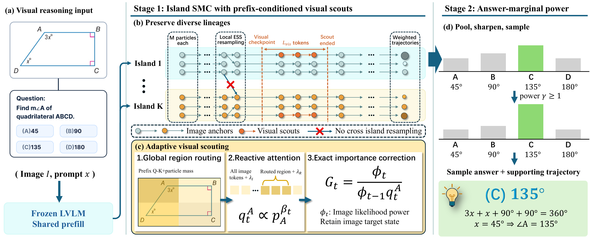
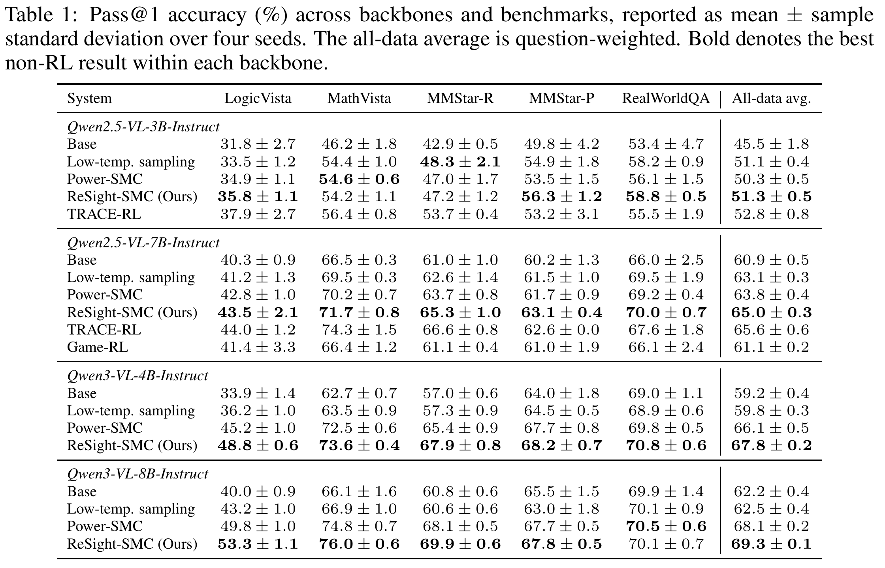

<h1 align="center">ReSight-SMC: Two-Stage Power Sampling via Island SMC with Visual Scouts</h1>

<p align="center">
  <a href="https://arxiv.org/abs/2609.34905"></a>
  <a href="LICENSE"></a>
</p>

## Overview

ReSight-SMC is a training-free, verifier-free two-stage power sampler for large vision-language models. Stage one maintains ancestry-isolated SMC islands for the base LVLM sequence-power target. Islands test for ESS-triggered resampling at regular token intervals. At a prespecified visual checkpoint, the remaining unfinished particles continue with the base proposal, while selected scouts use prefix-conditioned routing and attention-reactivated image tokens to form scout
proposals. Exact importance correction preserves the base LVLM target. Stage two aggregates
terminal mass by answer, applies a finite answer power, and samples an answer
with a supporting trajectory.



## Quick start

The environment targets Linux and NVIDIA GPUs with CUDA 12.8.

```bash
git clone https://github.com/yaowenzhang1/resight-smc.git
cd resight-smc
conda env create -f environment.yml
conda activate resight-smc
```

Pre-download models and datasets (replace these with the ones you plan to use):

```bash
python download.py --model Qwen/Qwen2.5-VL-7B-Instruct
python download.py --dataset logicvista
```

Run ReSight-SMC with the default model, dataset, and seed:

```bash
bash scripts/run_resight.sh
```

The default run uses Qwen2.5-VL-7B-Instruct, LogicVista, and seed 0. To choose another combination, set `MODEL`, `DATASET`, and `SEED` on the command line:

```bash
MODEL=Qwen/Qwen2.5-VL-3B-Instruct DATASET=mathvista SEED=1 \
  bash scripts/run_resight.sh
```

Supported datasets are `logicvista`, `mathvista`, `mmstar_r`, `mmstar_p`, and `realworldqa`.

## Main results



## Citation

We appreciate your citations if you find our paper related and useful to your research!

```bibtex
@misc{zhang2026resightsmctwostagepowersampling,
  title={ReSight-SMC: Two-Stage Power Sampling via Island SMC with Visual Scouts},
  author={Yaowen Zhang and Xiangyu Qiu and Junyi Hu and Zhi Lu and Wenwen Tian and Aoqin Wang and Junhai Luo and Zhenming Peng},
  year={2026},
  eprint={2609.34905},
  archivePrefix={arXiv},
  primaryClass={cs.CV},
  url={https://arxiv.org/abs/2609.34905}
}
```
